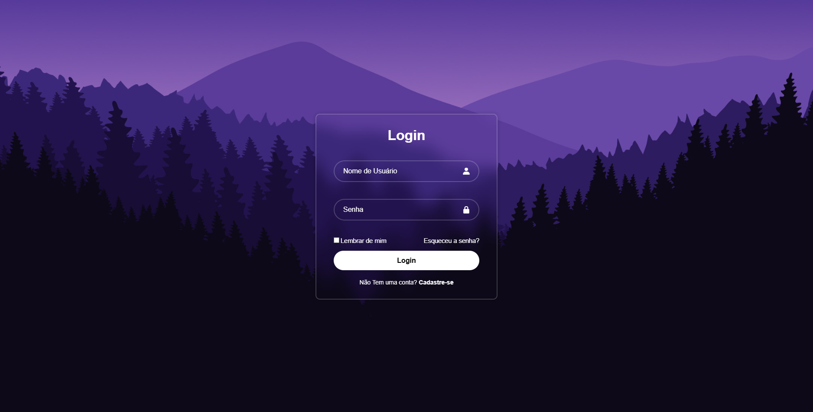
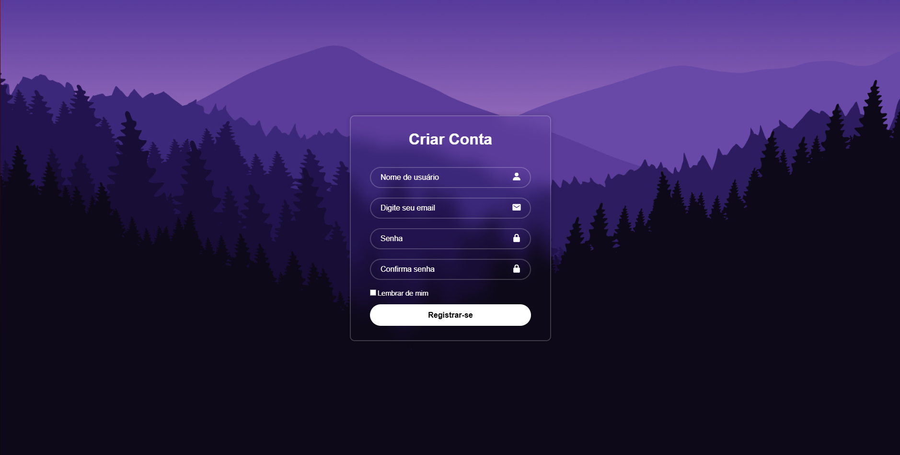

 [Login-Screen]


<p align="center">
  
</p>
<p align="center">
  
</p>

## 📜 Sobre o Projeto

Este projeto consiste em um sistema de autenticação robusto desenvolvido em **PHP 8** seguindo o paradigma de **Orientação a Objetos (POO)**. 

O objetivo principal foi criar uma arquitetura segura e escalável, focada na integridade dos dados e na experiência do usuário. O sistema implementa um **Login Híbrido**, permitindo que o usuário acesse sua conta tanto via E-mail quanto via Nome de Usuário, similar às grandes plataformas de rede social.

Destaques técnicos incluem:
* **Segurança (Security First):** Implementação de Prepared Statements com PDO para mitigação de falhas como SQL Injection.
* **Criptografia:** Senhas armazenadas exclusivamente via Hash (`password_hash` com algoritmos modernos como Bcrypt/Argon2), garantindo que dados sensíveis nunca trafeguem ou sejam salvos em texto plano.
* **Sanitização de Dados:** Tratamento rigoroso de inputs no Backend para prevenir ataques XSS.
* **Arquitetura:** Separação clara de responsabilidades entre a lógica de negócios (Classes) e a interface do usuário.
  
## ✨ Features (Funcionalidades)

* [x] **Autenticação Híbrida (Smart Login):** O sistema identifica automaticamente se o usuário digitou um e-mail ou nome de usuário no campo de login.
* [x] **Criptografia de Dados:** As senhas são processadas com algoritmos de hash seguros (`password_hash`), garantindo que não sejam armazenadas em texto puro.
* [x] **Validação de Integridade:** O cadastro impede registros duplicados verificando a existência prévia de e-mail ou usuário no banco de dados.
* [x] **Segurança Backend:** Consultas ao banco protegidas com Prepared Statements (PDO) para blindagem contra ataques de SQL Injection.
* [x] **Feedback de Usuário:** Sistema de mensagens dinâmicas que informa erros de credenciais ou sucesso no cadastro de forma clara.
* [x] **Interface Responsiva:** Layout adaptável para uso em Desktop e Mobile.


## 🚀 Tecnologias Utilizadas

Este projeto foi desenvolvido utilizando as seguintes tecnologias:

- PHP 8+
- MySQL (PDO com Prepared Statements)
- HTML5 / CSS3
- Hash de senha (Argon2/Bcrypt)

## ⚙️ Como Executar o Projeto

1. **Clone o repositório ou baixe o Zip:**
   ```bash
   git clone [https://github.com/ferinoSZ/Login-Screen.git](https://github.com/ferinoSZ/Login-Screen.git)
2. **Mova os arquivos:**
   * Pegue a pasta do projeto e mova para dentro do diretório raiz do seu servidor local (ex: C:\xampp\htdocs ou www).
3. **Crie o Banco de Dados:**
   * Acesse o phpMyAdmin (geralmente http://localhost/phpmyadmin).
   * Crie um novo banco de dados (ex: sistema_login).
   * Clique em "Importar" e selecione o arquivo banco.sql que está na pasta do projeto.
4. **Configure a Conexão:**
   * Na pasta do projeto, procure o arquivo conexao.exemplo.php.
   * Renomeie-o para conexao.php.
   * Abra o arquivo e coloque o nome do banco que você criou no passo 3, além do seu usuário (root) e senha.
5. **Tudo pronto!**
   * Acesse no seu navegador: http://localhost/Login-Screen/login.php

Pronto! Você já pode visualizar a página.

---
