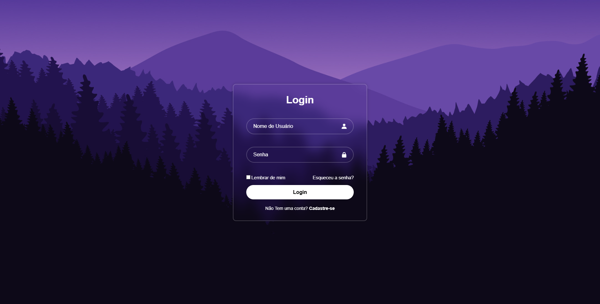
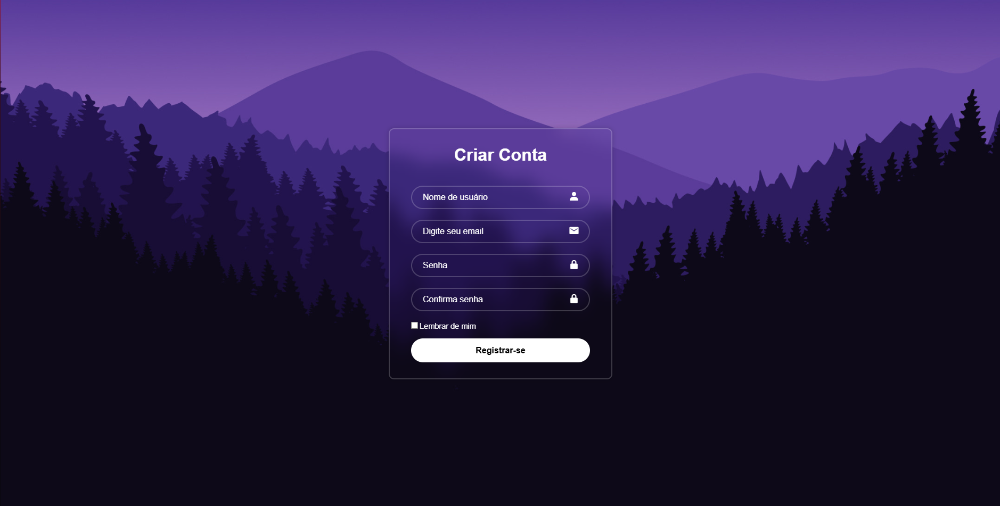

 [Login-Screen]


<p align="center">
  
</p>
<p align="center">
  
</p>

## 📜 Sobre o Projeto

Uma breve descrição sobre o que é o seu projeto. Tente responder:
* Esta é uma página de login para exibir e testar meus conhecimentos.
* Projeto de estudo para praticar CSS & HTML.

## ✨ Features

* [ ] **Layout Responsivo:** Funciona bem desktops.
* [ ] **Menu de Navegação:** Menu interativo para navegar entre as seções.
* [ ] **Formulário de Login:** Seção para os usuários enviarem informações de Login (fantasia).

## 🚀 Tecnologias Utilizadas

Este projeto foi desenvolvido utilizando as seguintes tecnologias:

* HTML5
* CSS3

## ⚙️ Como Executar o Projeto

Como é um projeto front-end simples, não há necessidade de instalação complexa. Siga os passos:

1.  Clone este repositório:
    ```bash
    git clone [https://github.com/](https://github.com/)[ferinoSZ]/[Login-Screen].git
    ```
2.  Abra a pasta do projeto.
3.  Abra o arquivo `index.html` no seu navegador de preferência.

Pronto! Você já pode visualizar a página.

---
